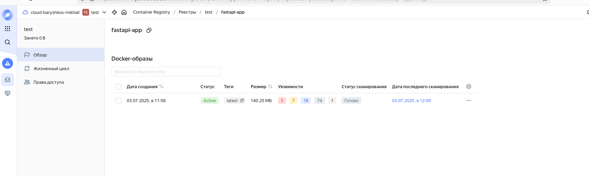

# Домашнее задание к занятию 5. «Практическое применение Docker» - Барышков Михаил

## Задача 1
1. Сделайте в своем GitHub пространстве fork [репозитория](https://github.com/netology-code/shvirtd-example-python).

2. Создайте файл ```Dockerfile.python``` на основе существующего `Dockerfile`:
   - Используйте базовый образ ```python:3.12-slim```
   - Обязательно используйте конструкцию ```COPY . .``` в Dockerfile
   - Создайте `.dockerignore` файл для исключения ненужных файлов
   - Используйте ```CMD ["uvicorn", "main:app", "--host", "0.0.0.0", "--port", "5000"]``` для запуска
   - Протестируйте корректность сборки 
3. (Необязательная часть, *) Изучите инструкцию в проекте и запустите web-приложение без использования docker, с помощью venv. (Mysql БД можно запустить в docker run).
4. (Необязательная часть, *) Изучите код приложения и добавьте управление названием таблицы через ENV переменную.
---
### ВНИМАНИЕ!
!!! В процессе последующего выполнения ДЗ НЕ изменяйте содержимое файлов в fork-репозитории! Ваша задача ДОБАВИТЬ 5 файлов: ```Dockerfile.python```, ```compose.yaml```, ```.gitignore```, ```.dockerignore```,```bash-скрипт```. Если вам понадобилось внести иные изменения в проект - вы что-то делаете неверно!
---

## Решение 1

запуск произодиться скриптом run.sh

## Задача 2 (*)
1. Создайте в yandex cloud container registry с именем "test" с помощью "yc tool" . [Инструкция](https://cloud.yandex.ru/ru/docs/container-registry/quickstart/?from=int-console-help)
2. Настройте аутентификацию вашего локального docker в yandex container registry.
3. Соберите и залейте в него образ с python приложением из задания №1.
4. Просканируйте образ на уязвимости.
5. В качестве ответа приложите отчет сканирования.


## Решние 2



## Задача 3
1. Изучите файл "proxy.yaml"
2. Создайте в репозитории с проектом файл ```compose.yaml```. С помощью директивы "include" подключите к нему файл "proxy.yaml".
3. Опишите в файле ```compose.yaml``` следующие сервисы: 

- ```web```. Образ приложения должен ИЛИ собираться при запуске compose из файла ```Dockerfile.python``` ИЛИ скачиваться из yandex cloud container registry(из задание №2 со *). Контейнер должен работать в bridge-сети с названием ```backend``` и иметь фиксированный ipv4-адрес ```172.20.0.5```. Сервис должен всегда перезапускаться в случае ошибок.
Передайте необходимые ENV-переменные для подключения к Mysql базе данных по сетевому имени сервиса ```web``` 

- ```db```. image=mysql:8. Контейнер должен работать в bridge-сети с названием ```backend``` и иметь фиксированный ipv4-адрес ```172.20.0.10```. Явно перезапуск сервиса в случае ошибок. Передайте необходимые ENV-переменные для создания: пароля root пользователя, создания базы данных, пользователя и пароля для web-приложения.Обязательно используйте уже существующий .env file для назначения секретных ENV-переменных!

2. Запустите проект локально с помощью docker compose , добейтесь его стабильной работы: команда ```curl -L http://127.0.0.1:8090``` должна возвращать в качестве ответа время и локальный IP-адрес. Если сервисы не стартуют воспользуйтесь командами: ```docker ps -a ``` и ```docker logs <container_name>``` . Если вместо IP-адреса вы получаете информационную ошибку --убедитесь, что вы шлете запрос на порт ```8090```, а не 5000.

5. Подключитесь к БД mysql с помощью команды ```docker exec -ti <имя_контейнера> mysql -uroot -p<пароль root-пользователя>```(обратите внимание что между ключем -u и логином root нет пробела. это важно!!! тоже самое с паролем) . Введите последовательно команды (не забываем в конце символ ; ): ```show databases; use <имя вашей базы данных(по-умолчанию example)>; show tables; SELECT * from requests LIMIT 10;```.

6. Остановите проект. В качестве ответа приложите скриншот sql-запроса.

## Решение 3


